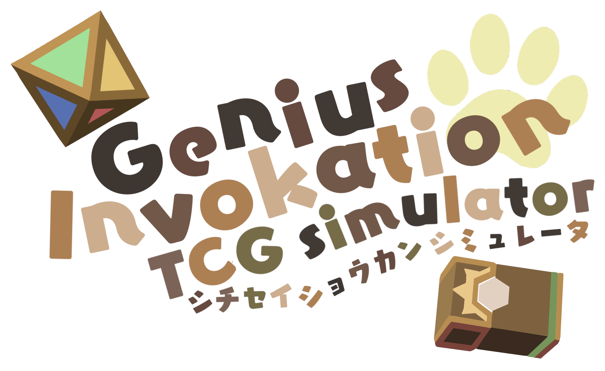
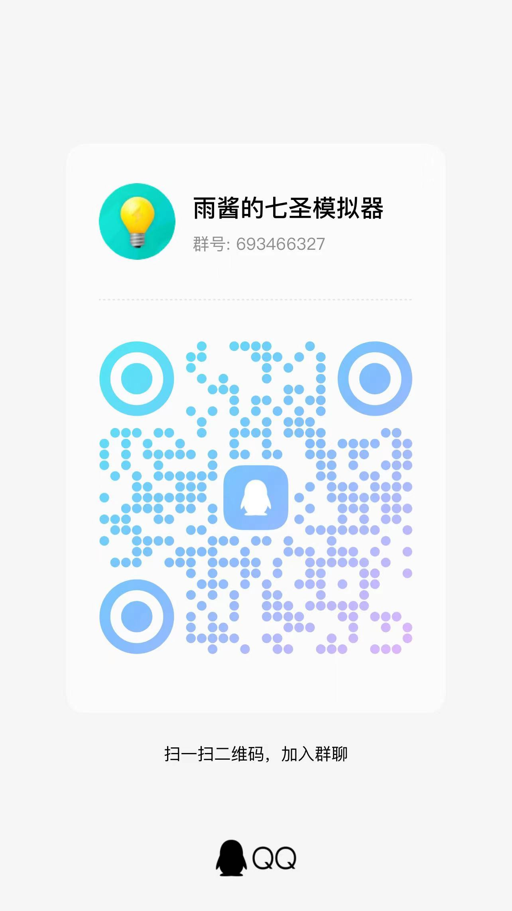

# 七圣召唤模拟器（更新至 5.0）

可访问 https://gi-tcg.vercel.app 或 https://gi-tcg.guyutongxue.site 试用。

## 本项目特点

- 完全开源（主体使用 AGPLv3.0 or later）
- 核心实现了目前最接近官方的结算规则
- 截止 5.0 为止的全部卡牌定义
  - 定义格式简介明了、清晰易读
  - 易于维护
- 全部旧版本卡牌（平衡性调整前）的定义
  - 支持自选游戏版本开始对局
- 前端功能：
  - 牌局可视化和本地模拟
  - 历史回溯（复盘）和中途继续
  - 对局导入导出
  - 查看结算细节日志
  - 双人对战模式，但是由于没有服务器支持，很卡
- 跨程序通信支持（基于 WebSocket/HTTP）
  - 可用于开发 AI
- 肯定**有很多 bug**，需要测试

## [关于开发](./docs/development/README.md)

上述链接可查看（可能是过时的）开发文档和注记。

<table>
<tbody>
<tr>
<td>

如果有意图参与本项目开发，欢迎加 QQ 群 [693466327](https://qm.qq.com/q/X7XpZg4rW8) 讨论。

</td>
<td>

</td>
<tr>
<td colspan="2">

进群口令可在 [`packages/data/src/characters/pyro/amber.ts`](./packages/data/src/characters/pyro/amber.ts) 中找到~

</td>
</tr>
</tbody>
</table>

