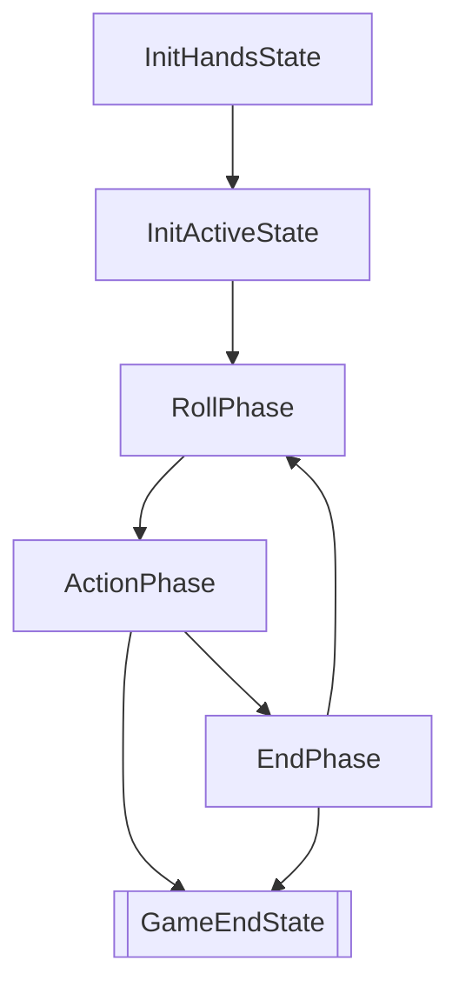

# 游戏阶段

七圣召唤的完整流程也可以视作若干阶段的转移，即有限状态自动机：

在不考虑放弃对局的情形下，整个游戏的流程如上所示。

- `InitHandsState`，在这个阶段下双方获得初始手牌。
- `InitActiveState`，在这个阶段下双方获得初始出战角色。
- `RollPhase` `ActionPhase` `EndPhase` 是每一回合的三个阶段。其中，`ActionPhase` 内部是一个循环，包括每个人的行动轮，但这里并不划分到那个精细度上。
- `GameEndState` 是游戏决出胜负或者平局的最终阶段。

之所以将游戏开始额外划分出三个阶段，是因为选择手牌后、选择出战角色后，都有一个同步操作（即等待对方也完成）。游戏过程中的手牌改动、出战角色改动都是实时的，性质不一样。
