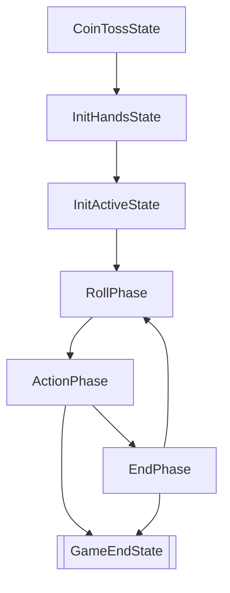

# 状态自动机

正如同大多数卡牌游戏，七圣召唤也可以视作一个有限状态自动机：



在不考虑主动投降的情形下，整个游戏的流程如上所示。

- `CoinTossState`，即决定先手的状态，这是 PvP 游戏的起始状态。
- `InitHandsState`，在这个状态下双方获得初始手牌。
- `InitActiveState`，在这个状态下双方获得初始出战角色。
- `RollPhase` `ActionPhase` `EndPhase` 是每一回合的三个阶段。其中，`ActionPhase` 内部是一个循环，包括每个人的行动轮，但这里并不划分到那个精细度上。
- `GameEndState` 是游戏决出胜负或者平局的最终状态。

之所以将游戏开始额外划分出三个状态，是因为选择手牌后、选择出战角色后，都有一个同步操作（即等待对方也完成）。游戏过程中的手牌改动、出战角色改动都是实时的，性质不一样。

## 状态数据

不考虑前面这三个信息不完整的状态；在游戏过程主体的状态数据包括：

```ts
type Pair<T> = [T, T];  // 双方都有的信息直接用这个类型表示

interface State {
  players: Pair<any>;   // 玩家信息，没用到，考虑删除

  roundNumber: number;  // 回合数
  turn: 0 | 1;          // 当前行动轮玩家
  nextTurn: 0 | 1;      // 下一行动轮玩家

  dice: Pair<DiceType[]>;          // 骰子情况
  actives: Pair<number>;           // 出战角色编号 0 1 2
  piles: Pair<Card[]>;             // 牌堆信息
  hands: Pair<Card[]>;             // 手牌信息
  characters: Pair<Character[]>;   // 出战角色信息
  combatStatuses: Pair<Status[]>;  // 出战状态信息
  supports: Pair<Support[]>;       // 支援区信息 TODO 
  summons: Pair<Summon[]>;         // 召唤物信息 TODO
}
```

这里涉及到的其他类型，可参考其他文档页面，也可能没写。

## 外观（Facade）

对于前端来说，它不能知道所有的状态信息，比如前端不应该知道对手的手牌信息。因此，从状态可以生成一个“状态外观”，只提供前端需要的信息：

```ts

interface CharacterFacade {
  readonly id: number;
  readonly objectId: number;
  health: number;
  energy: number;
  weapon?: number;
  artifact?: number;
  equipments: number[];
  statuses: StatusFacade[];
  applied: Aura;
}

interface StatusFacade {
  readonly id: number;
  readonly objectId: number;
  value?: number;
}

interface SupportFacade {
  readonly id: number;
  readonly objectId: number;
  value?: number;
}

interface SummonFacade {
  readonly id: number;
  readonly typeId: number;
  value: number;
}

interface StateFacade {
  pileNumber: number;
  hands: number[],
  active?: number;
  characters: CharacterFacade[];
  combatStatuses: StatusFacade[];
  supports: SupportFacade[];
  summons: SummonFacade[];
  dice: DiceType[];
  // 以下是对手信息
  oppPileNumber: number;
  oppHandsNumber: number;
  oppActive?: number;
  oppCharacters: CharacterFacade[];
  oppCombatStatuses: StatusFacade[];
  oppSupports: SupportFacade[];
  oppSummons: SummonFacade[];
  oppDiceNumber: number;
}
```

上述类型信息可能并不是最新的代码。

其中：
- `id` 是当前棋盘上指示实体用的索引：
  - 对于角色来说，就是 `0` `1` `2`；（如果出现需要用到对方角色的场景，那么接着用 `3` `4` `5`）
  - 对于支援、召唤物、状态与出战状态，`id` 是动态生成的不重复值（e.g. 两个同种支援/状态的 `id` 不同）
- `objectId` 是指示该实体的类型信息用的索引：
  - 这些数据尽量和原神客户端的内部 id 保持一致；
  - 从而可以基于 `objectId` 提供前端的更多信息/帮助。
  - 角色技能没有 `objectId`，直接使用技能名识别，这或许是代码缺陷；主要是简化代码编写的角度如是设计的。
- 支援、召唤物、状态与出战状态的 `value` 是前端显示的数字（右上角或右下角），指示可用次数、持续回合等。
