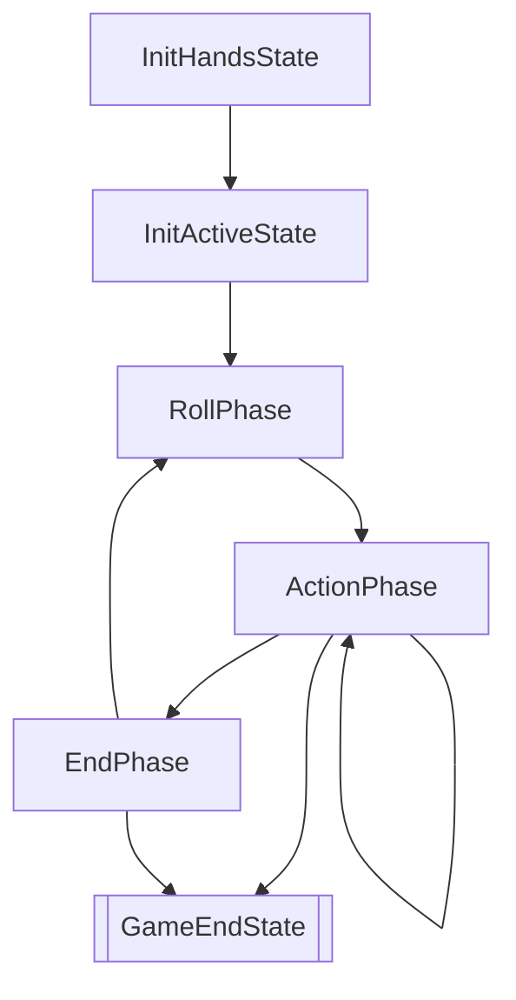

# 状态自动机

正如同大多数卡牌游戏，七圣召唤也可以视作一个有限状态自动机：



在不考虑主动投降的情形下，整个游戏的流程如上所示。

- `InitHandsState`，在这个状态下双方获得初始手牌。
- `InitActiveState`，在这个状态下双方获得初始出战角色。
- `RollPhase` `ActionPhase` `EndPhase` 是每一回合的三个阶段。其中，`ActionPhase` 内部是一个循环，包括每个人的行动轮，但这里并不划分到那个精细度上。
- `GameEndState` 是游戏决出胜负或者平局的最终状态。

之所以将游戏开始额外划分出三个状态，是因为选择手牌后、选择出战角色后，都有一个同步操作（即等待对方也完成）。游戏过程中的手牌改动、出战角色改动都是实时的，性质不一样。

## 外观数据

对于前端来说，它不能知道所有的状态信息，比如前端不应该知道对手的手牌信息。因此，从状态可以生成一个“状态外观数据”，只提供前端需要的信息：

```ts
// TODO
```

上述类型信息可能并不是最新的代码。

其中：
- `entityId` 是当前棋盘上指示实体用的索引：
  - 全盘唯一，可用作前端提示。
- `id` 是指示该实体的类型信息用的索引：
  - 这些数据尽量和原神客户端的内部 id 保持一致；
  - 从而可以基于 `id` 提供前端的更多信息/帮助。
- 支援、召唤物、状态与出战状态的 `value` 是前端显示的数字（右上角或右下角），指示可用次数、持续回合等。
