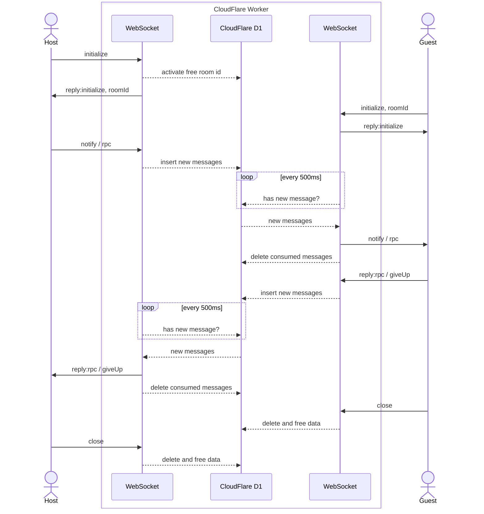

# PvP 中转 worker

利用 CloudFlare D1 数据库保存连接状态，实现 PvP 对局。

## 原理图



## API

### 创建房间

```
ws://HOST/ws/request-room
```

发送 `{ "method": "initialize" }`，等待 `{ "method": "reply:initialize", "roomId": xxx }` 响应获取房间号。

### 加入房间

```
ws://HOST/ws/room/:id
```

发送 `{ "method": "initialize" }`，等待 `{ "method": "reply:initialize" }` 响应。

### 传输数据

- Host 端发送任意 `method` 为 `rpc` 或 `notify` 的消息；
- Guest 端发送任意 `method` 为 `reply:pc` 或 `giveUp` 的消息；
- 对方会在 500ms 左右后收到。

