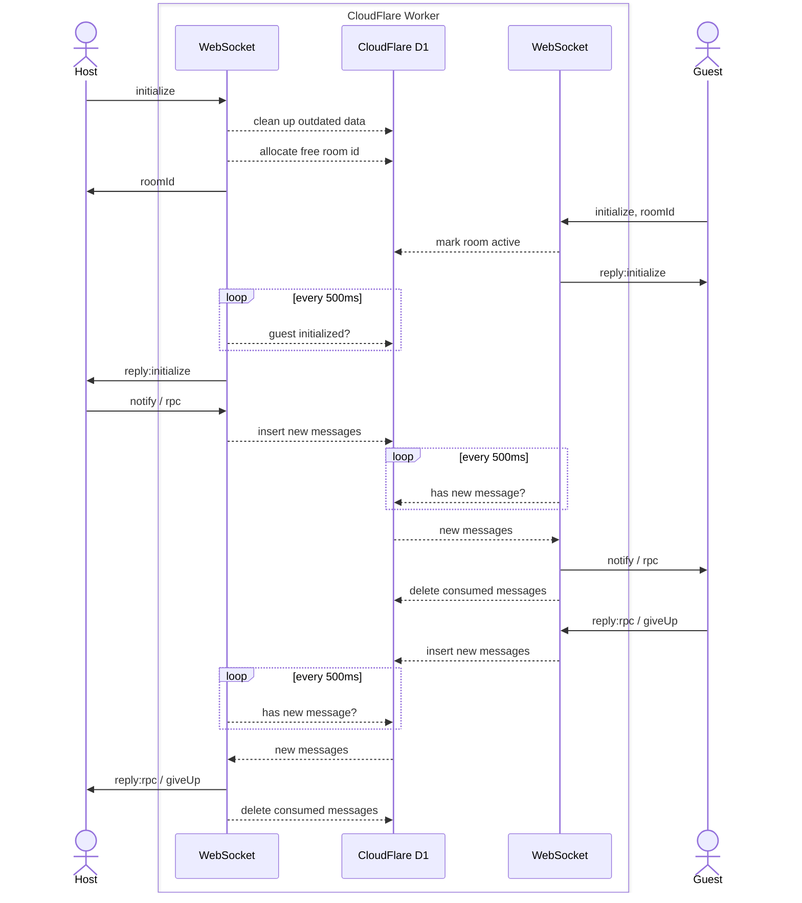

# PvP 中转 worker

利用 CloudFlare D1 数据库保存连接状态，实现 PvP 对局。

## 原理图



## API

### 创建房间

```
ws://HOST/ws/request-room
```

```ts
// 发送
interface HostInitializeRequest {
  method: "initialize";
  who?: 0 | 1;
}
// 获取房间号
interface RoomIdResponse {
  method: "roomId";
  roomId: number;
}
// 初始化完成
interface HostInitializeResponse {
  method: "reply:initialize";
  who: 0 | 1;
  guestDeck: string;
}
```

### 加入房间

```
ws://HOST/ws/room/:id
```

```ts
// 发送
interface GuestInitializeRequest {
  method: "initialize";
  deck: string;
}
// 初始化完成
interface HostInitializeResponse {
  method: "reply:initialize";
  who: 0 | 1;
}
```

### 传输数据

- Host 端发送任意 `method` 为 `rpc` 或 `notify` 的消息；
- Guest 端发送任意 `method` 为 `reply:pc` 或 `giveUp` 的消息；
- 对方会在 500ms 左右后收到。


## 开发相关

```sh
# 登录个人账号，创建 D1 数据库
bunx wrangler login
bunx wrangler d1 create gi-tcg-pvp
# 将返回的 id 值更新到 wrangler.toml database_id

# 本地测试
bunx wrangler d1 execute gi-tcg-pvp --local --file=src/schema.sql
bun dev
# 本地 SQLite 文件存放在 .wrangler/state/v3/d1/miniflare-D1DatabaseObject/<...>.sqlite

# 部署
bunx wrangler d1 execute gi-tcg-pvp --remote --file=src/schema.sql
bun run deploy
```
